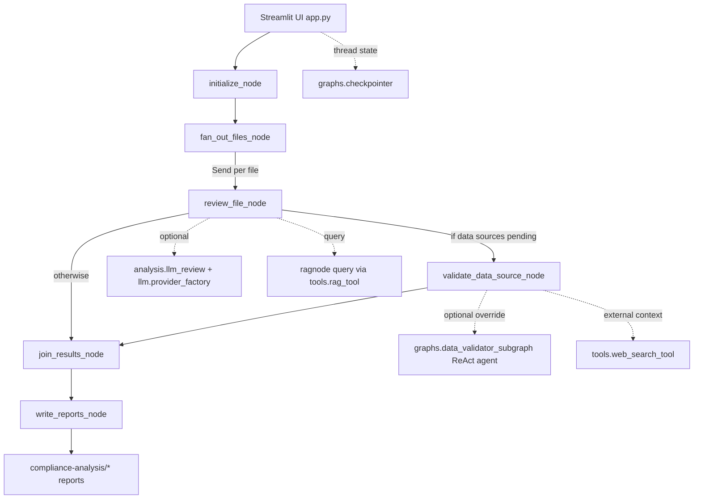

# AI Ethics Compliance Agent: Architecture Deep Dive

## 1. Purpose and Architectural Style

The system is a graph-orchestrated, multi-stage compliance scanner for local directories that may contain:

- source code,
- documentation,
- structured datasets,
- configuration files, and
- binary/media artifacts.

It combines deterministic static analysis with optional LLM enrichment and retrieval-augmented grounding against an internal ethics knowledge base PDF.

At a high level, this is a **LangGraph stateful workflow** with:

- fan-out parallel file review,
- optional per-file data-source validation,
- result aggregation and deduplication,
- final report synthesis (Markdown + HTML), and
- checkpointed resumability.

## 2. Layered Architecture

### 2.1 Presentation Layer (Streamlit)

Responsibilities:

- collect scan parameters (target dir, provider, model, runtime mode),
- trigger start/resume scans,
- stream live progress/events,
- render final reports,
- manage KB ingestion/query,
- expose tracing status.

Files:

- `app.py` (entrypoint, tab orchestration, scan execution)
- `ui/sidebar.py` (scan controls + provider connection test)
- `ui/scan_tab.py` (live progress table/log rendering + stream event consumption)
- `ui/report_tab.py` (final report rendering and download)
- `ui/kb_tab.py` (KB readiness, rebuild, debug query)
- `ui/langsmith_tab.py` (tracing status panel)

### 2.2 Orchestration Layer (LangGraph)

Responsibilities:

- define directed workflow and conditional routing,
- fan-out file-level workloads,
- invoke node functions over shared state,
- checkpoint graph execution for resume support.

Files:

- `graphs/compliance_graph.py` (main graph topology + conditional routes)
- `graphs/checkpointer.py` (SQLite/Postgres checkpointer provisioning + thread discovery)

Related helper subgraph builders:

- `graphs/data_validator_subgraph.py` (ReAct agent builder used by data-source validator)
- `graphs/file_review_subgraph.py` (file review ReAct builder; currently not wired into runtime path)
- `graphs/report_writer_subgraph.py` (report writer ReAct builder; currently not wired into runtime path)

### 2.3 Node Execution Layer

Responsibilities:

- perform step-specific business logic over state,
- emit progress events,
- persist per-file/final artifacts.

Files:

- `nodes/initialize.py` (validate target dir, create output dir, emit scan-start event)
- `nodes/fan_out.py` (file discovery, filtering, classification)
- `nodes/review_file.py` (deterministic analysis + optional LLM assessment + per-file report write)
- `nodes/validate_data_source.py` (validate referenced URLs/paths, optional LLM override, merge results)
- `nodes/join_results.py` (dedupe by best-quality result per file)
- `nodes/write_reports.py` (build and write final report artifacts)

### 2.4 Analysis and Compliance Logic Layer

Responsibilities:

- content extraction and categorization,
- heuristic rule matching,
- sensitive-field and data-source extraction,
- data-source risk validation,
- LLM-grounded final file-level compliance decisions.

Files:

- `analysis/core.py` (deterministic analysis engine)
- `analysis/llm_review.py` (chunking, RAG query generation, RAG-grounded final LLM assessment)
- `analysis/reports.py` (per-file and consolidated report generation)

### 2.5 Knowledge and Retrieval Layer (RAG)

Responsibilities:

- ingest ethics PDF into vector store,
- query retrieved chunks for regulatory grounding,
- provide resilient embedding fallback behavior.

Files:

- `rag/ingestor.py` (PDF chunking + embedding + Chroma write)
- `rag/retriever.py` (retriever singleton, embedding setup, query API)
- `tools/rag_tool.py` (tool wrapper used by nodes/agents)

### 2.6 External Integration Layer (LLM + Web + Tracing)

Responsibilities:

- instantiate model providers with retry/rate limiting,
- optional web provenance checks,
- optional LangSmith trace propagation.

Files:

- `llm/provider_factory.py` (providers: openrouter, groq, ollama_local, ollama_cloud)
- `tools/web_search_tool.py` (Tavily, optional DDGS fallback)
- `tracing/langsmith_setup.py` (run config and callback wiring)
- `utils/compat.py` (safe fallbacks when tool/trace integrations are absent)

### 2.7 I/O, Utility, and Prompt Layer

Responsibilities:

- robust and safe file operations,
- atomic writes and lock coordination,
- parsing LLM `<RESULT>{...}</RESULT>` payloads,
- prompt loading.

Files:

- `tools/filesystem_tools.py` (safe pathing, read/write, command execution, dir listing)
- `utils/strings.py` (tagged JSON extraction, truncation, filename slugging)
- `prompts/loader.py` (prompt file loading with cache)
- `prompts/file_reviewer.md`
- `prompts/data_source_validator.md`
- `prompts/report_writer.md`
- `prompts/orchestrator.md`

### 2.8 Schema and Event Contracts

Responsibilities:

- define typed workflow state payloads and event format.

Files:

- `models/state.py` (TypedDict contracts for findings, file results, state)
- `models/events.py` (timestamped progress event factory)

### 2.9 Developer and Verification Layer

Responsibilities:

- operational scripts for ingestion and fixture verification,
- deterministic tests for core components.

Files:

- `scripts/ingest_knowledge_base.py`
- `scripts/verify_demo_scan.py`
- `tests/test_analysis_core.py`
- `tests/test_config_loader.py`
- `tests/test_join_results.py`
- `tests/test_llm_review.py`
- `tests/test_reports.py`

## 3. Runtime Dataflow

## 4. Detailed Workflow by Node

### 4.1 initialize

Implementation: `nodes/initialize.py`

Input fields consumed:

- `target_directory`
- `config.scan.output_dir`

Outputs:

- `_analysis_output_dir`
- reset file discovery collections (`all_files`, `skipped_files`, `file_categories`)
- `scan_complete=False`, `scan_error=None`
- progress event: `scan_started`

Failure mode:

- returns `scan_error` if target directory is invalid.

### 4.2 fan_out_files

Implementation: `nodes/fan_out.py`

Core mechanics:

- uses `list_directory_robust()` for recursive discovery,
- excludes generated output directory,
- applies extension/size filters from config,
- categorizes each retained file using `analysis.core.categorize_file()`.

Outputs:

- `all_files`, `skipped_files`, `file_categories`
- progress event: `discovery_complete`

Routing behavior (in graph):

- if no files => direct `join_results`
- else => `Send(...)` fan-out into per-file `review_file` tasks.

### 4.3 review_file

Implementation: `nodes/review_file.py`

Pipeline:

1. deterministic analysis via `analysis.core.analyze_file()`
2. optional LLM pass via `analysis.llm_review.assess_file_with_llm()`
3. write per-file report via `analysis.reports.build_file_report_markdown()`
4. stage pending data sources for validation.

Important behavior:

- if runtime provider/model are set to unsupported values (e.g. deterministic mode), `try_create_llm()` returns `None`; deterministic results are kept.
- catches exceptions and emits a fallback `ERROR` file result rather than crashing the graph.

Outputs:

- `file_results` append
- `_pending_data_sources`
- `_current_file_result`
- progress events: `file_started`, `file_complete`

### 4.4 validate_data_source

Implementation: `nodes/validate_data_source.py`

Pipeline:

1. for each pending source, run deterministic `validate_data_source_reference()`
2. optionally invoke a ReAct validator agent (`graphs/data_validator_subgraph.py`) for override fields
3. merge validated source outcomes back into file results with `merge_data_source_results()`
4. rewrite updated per-file report markdown.

Output effects:

- updates `file_results`
- emits `data_source_found` and `data_source_validated` events.

### 4.5 join_results

Implementation: `nodes/join_results.py`

Purpose:

- resolve duplicates from parallel paths by selecting the best-quality result for each file based on a quality tuple:
  - status score,
  - absence of error,
  - finding count,
  - validated source count,
  - report write presence.

Outputs:

- `_deduped_file_results`
- progress event: `aggregation_complete`

### 4.6 write_reports

Implementation: `nodes/write_reports.py`

Actions:

- builds report context via `build_report_context()`
- generates markdown via `build_final_report_markdown()`
- generates HTML via `build_final_report_html()`
- atomically writes:
  - `final_compliance_report.md`
  - `final_compliance_report.html`

Outputs:

- `final_report_md`, `final_report_html`
- `scan_complete=True`
- progress event: `scan_complete`

## 5. State Model and Data Contracts

Source: `models/state.py`

Key entities:

- `Finding`: severity, location, regulations, jurisdictions, KB citation fields
- `DataSourceResult`: source verdict and provenance metadata
- `FileResult`: per-file status + summary + findings + data-source review
- `ProgressEvent`: event log payload
- `ComplianceState`: full graph state, including internal transient keys prefixed with `_`

Aggregation semantics:

- `file_results` and `progress_events` use additive reducers (operator.add), enabling safe accumulation from parallel fan-out branches.

## 6. Deterministic Analysis Engine

Source: `analysis/core.py`

Major capabilities:

- file type categorization and language inference,
- text extraction (including DOCX support),
- heuristic rule matching (`RULES`) for known risk patterns,
- schema and sensitive-field inference,
- extraction of explicit data source references (URLs and local paths),
- deterministic data-source risk validation for URL/local paths,
- merging source verdicts into findings/status.

Notable policy/rule modeling:

- explicit rule records with code/title/severity/query/regulations/jurisdictions,
- severity-driven status derivation (`FAIL`, `WARN`, `PASS`),
- additional structured-data sensitive-attribute rule when multiple sensitive signals are detected.

## 7. LLM Enrichment and Grounded Decisioning

Source: `analysis/llm_review.py`

Pipeline design:

1. if large file, chunk and summarize all chunks (`_summarize_large_file`)
2. generate targeted legal/RAG queries (`_generate_rag_queries`)
3. retrieve and de-duplicate KB hits (`_retrieve_rag_hits`)
4. ask final assessment model with strict JSON schema and citation requirement
5. validate/normalize findings and enforce status monotonicity relative to severity.

Guardrails:

- no findings without structured parse,
- no weaker final status than severity-derived status,
- PASS when no grounded violation is established,
- carries forward deterministic baseline notes with provenance notes from the LLM phase.

## 8. RAG Architecture

### 8.1 Ingestion

Source: `rag/ingestor.py`

Flow:

- open PDF using `fitz` (PyMuPDF),
- split per page text into chunks,
- generate chunk IDs (`p{page}_c{chunk}`),
- embed chunks, write vectors and metadata to Chroma persistent collection,
- clear retriever singleton cache after rebuild.

### 8.2 Retrieval

Source: `rag/retriever.py`

Features:

- lazy singleton instances keyed by `(persist_dir, collection_name)`
- pluggable embedding provider with resilient fallback chain:
  - OpenAI/Ollama embeddings
  - hash-based offline embedding fallback (`HashingEmbeddings`)
- returns chunk text + metadata + distance score.

### 8.3 Tool Interface

Source: `tools/rag_tool.py`

Provides a stable callable tool abstraction for node/agent usage and default config loading when explicit config is absent.

## 9. LLM Provider Strategy

Source: `llm/provider_factory.py`

Supported providers:

- `openrouter`
- `groq`
- `ollama_local`
- `ollama_cloud`

Capabilities:

- provider-specific API key expectation checks,
- local Ollama model discovery via CLI,
- in-memory cache by `(provider, model, base_url, temperature)`,
- optional LangChain rate limiter,
- retry wrapping when provider client supports `with_retry`,
- safe `try_create_llm()` for non-fatal fallback to deterministic behavior.

## 10. Filesystem and Safety Model

Source: `tools/filesystem_tools.py`

Protection and reliability mechanisms:

- path traversal protection (`safe_resolve_path` with optional root constraint),
- robust listing and read retries,
- binary detection during reads,
- atomic write with temporary file + move,
- optional file lock (`.lock`) for concurrent writes,
- constrained shell execution with banned dangerous pattern checks.

This underpins safe report generation and tooling calls under concurrent graph execution.

## 11. Reporting Architecture

### 11.1 Per-File Reports

Source: `analysis/reports.py` -> `build_file_report_markdown()`

Sections include:

- file overview,
- summary,
- predicted output,
- findings with regulations/jurisdictions/KB citation,
- data source table,
- operational notes.

### 11.2 Final Consolidated Reports

Source: `analysis/reports.py`

- `build_report_context()` computes executive and aggregate structures
- `build_final_report_markdown()` emits markdown compliance dossier
- `build_final_report_html()` renders template

Template source:

- `templates/report.html.j2`

Output location:

- `<target_dir>/compliance-analysis/`

## 12. Checkpointing and Resume

Source: `graphs/checkpointer.py`

Modes:

- SQLite (default)
- Postgres (if configured via env)

Behavior:

- shared saver cache per backend endpoint/path,
- SQLite thread-safe connection creation (`check_same_thread=False`),
- thread ID enumeration from checkpoint tables for UI resume dropdown.

## 13. Observability and Tracing

Sources:

- `tracing/langsmith_setup.py`
- `utils/compat.py`
- `ui/langsmith_tab.py`

Design:

- tracing defaults to enabled unless env flags explicitly disable,
- gracefully degrades when LangSmith packages/config are unavailable,
- graph run config includes thread, provider/model tags, and target-dir metadata.

## 14. Configuration System

Sources:

- `config_loader.py`
- `config.yaml`

Capabilities:

- deep merge from defaults + YAML,
- alias normalization (`skip_extensions` <-> `excluded_extensions`, etc.),
- compatibility hydration for knowledge/rag/provider defaults.

Key domains:

- `llm`, `scan`, `rag`, `review`, `filesystem`, `checkpoint`, `web_search`, `langsmith`.

## 15. Testing and Validation Strategy

Representative tests:

- `tests/test_analysis_core.py`: source/path extraction, deterministic rule triggering, citation propagation
- `tests/test_llm_review.py`: grounded FAIL/PASS behavior with stubbed LLM
- `tests/test_reports.py`: key report section generation
- `tests/test_join_results.py`: result quality dedupe behavior
- `tests/test_config_loader.py`: config merging and alias normalization

Operational scripts:

- `scripts/ingest_knowledge_base.py`: KB rebuild + retrieval probe
- `scripts/verify_demo_scan.py`: end-to-end fixture scan with deterministic retry fallback

## 16. Component-to-File Correlation Matrix

| Architectural Component | Primary Files |
|---|---|
| App bootstrap and tab container | `app.py` |
| User controls and run initiation | `ui/sidebar.py`, `ui/scan_tab.py` |
| Graph topology and conditional routing | `graphs/compliance_graph.py` |
| Checkpoint backend and resume IDs | `graphs/checkpointer.py` |
| Initialization node | `nodes/initialize.py` |
| File discovery and fan-out node | `nodes/fan_out.py` |
| File review node | `nodes/review_file.py` |
| Data source validation node | `nodes/validate_data_source.py` |
| Aggregation node | `nodes/join_results.py` |
| Final report writer node | `nodes/write_reports.py` |
| Deterministic static analysis core | `analysis/core.py` |
| LLM file-level grounding logic | `analysis/llm_review.py` |
| Reporting builders | `analysis/reports.py`, `templates/report.html.j2` |
| LLM provider adapters | `llm/provider_factory.py` |
| RAG ingest and query | `rag/ingestor.py`, `rag/retriever.py`, `tools/rag_tool.py` |
| Filesystem and shell tools | `tools/filesystem_tools.py` |
| Web provenance checks | `tools/web_search_tool.py` |
| Prompt loading and prompt assets | `prompts/loader.py`, `prompts/*.md` |
| State/event typed contracts | `models/state.py`, `models/events.py` |
| Trace integration | `tracing/langsmith_setup.py`, `utils/compat.py` |
| Runtime config merge and defaults | `config_loader.py`, `config.yaml` |
| Scripts for ops and smoke verification | `scripts/ingest_knowledge_base.py`, `scripts/verify_demo_scan.py` |
| Automated test suite | `tests/test_*.py` |

## 17. Current Design Strengths and Practical Constraints

Strengths:

- deterministic-first behavior means scans can still run when LLM/web integrations fail,
- graph fan-out provides scalable per-file parallelization,
- additive state reducers and dedupe stage make concurrency robust,
- per-file and final artifacts are generated atomically,
- RAG citations are part of finding schema for traceable compliance rationale.

Constraints / implementation nuances:

- `graphs/file_review_subgraph.py` and `graphs/report_writer_subgraph.py` are currently helper builders but not active in the default graph path,
- deterministic mode is implemented by selecting a provider/model that intentionally fails provider instantiation, causing safe fallback to deterministic-only behavior,
- quality of compliance verdicts remains bounded by static pattern coverage (`analysis/core.py`) and RAG corpus breadth.

## 18. End-to-End Execution Summary

1. User selects target/provider/model in Streamlit.
2. Graph initializes output and scan state.
3. Files are discovered, filtered, categorized.
4. Each file is reviewed deterministically; optionally refined by LLM grounded via RAG.
5. Referenced data sources are validated deterministically and optionally refined by agentic LLM.
6. Duplicate/partial branch results are quality-deduped.
7. Consolidated markdown/html reports are generated and persisted.
8. UI shows live status/logs and renders downloadable outputs.

This architecture yields a resilient, inspectable compliance pipeline suitable for mixed-codebase scanning with optional agentic enrichment rather than strict dependence on model availability.
